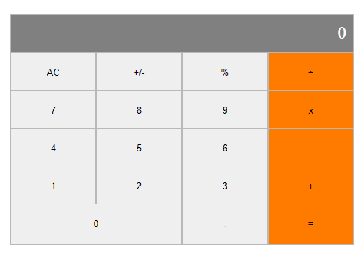

## Math Magicians App

## Live Demo

[Visit Live Demo Link](https://felipeg005.github.io/Math-Magicians-App/)

## Getting Started

You can visit the Live Demo or clone the repository and open the dist/html.index file with your browser to see the project.

- Follow the [Set-up and Install](#set-up--install) instructions.

### Prerequisites

- Before we begin, make sure you have a fresh version of Node.js installed

### Set-up & Install

- [First clone the repo](https://github.com/Felipeg005/Math-Magicians-App/) and checkout the latest branch.

To install the latest release or a specific version, run one of the following commands:

- `npm install && npm install --dev` to install the project's dependencies.

## Available Scripts

In the project directory, you can run:

`npm start`

Runs the app in the development mode.\
Open [http://localhost:3000](http://localhost:3000) to view it in the browser.

The page will reload if you make edits.\
You will also see any lint errors in the console.

`npm test`

Launches the test runner in the interactive watch mode.\
See the section about [running tests](https://facebook.github.io/create-react-app/docs/running-tests) for more information.

`npm run build`

Builds the app for production to the `build` folder.\
It correctly bundles React in production mode and optimizes the build for the best performance.

## Built With

- JavaScript-Webpack-Jest-React

This project was bootstrapped with [Create React App](https://github.com/facebook/create-react-app).

## 👤 **Author**

**Juan Felipe Gomez Tobon**

- GitHub: [@githubhandle](https://github.com/Felipeg005/)
- Twitter: [@twitterhandle](https://twitter.com/JuanFGT05)
- LinkedIn: [LinkedIn](https://www.linkedin.com/in/juan-felipe-gomez-tobon/)

## Show your support

Give a ⭐️ if you like this project!

## Acknowledgments

- Thanks to Microverse for making it possible!

## 📝 License

This project is [MIT](./MIT.md) licensed.